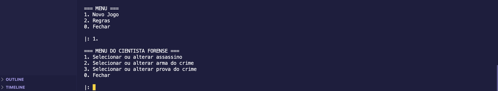
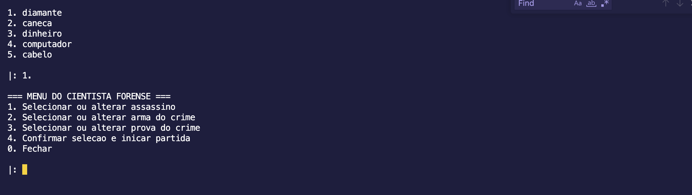
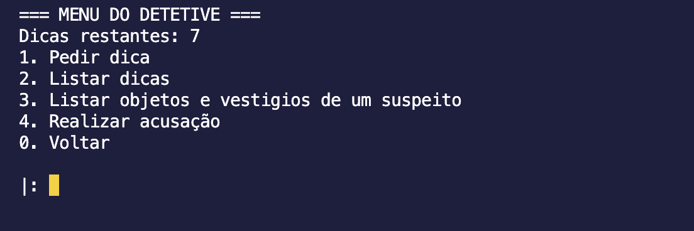
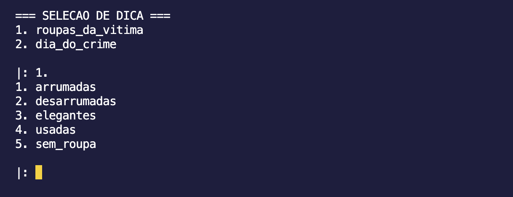
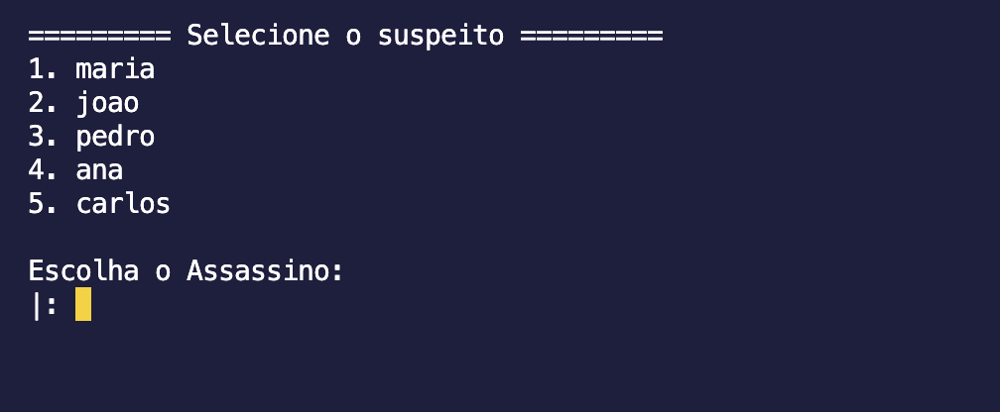
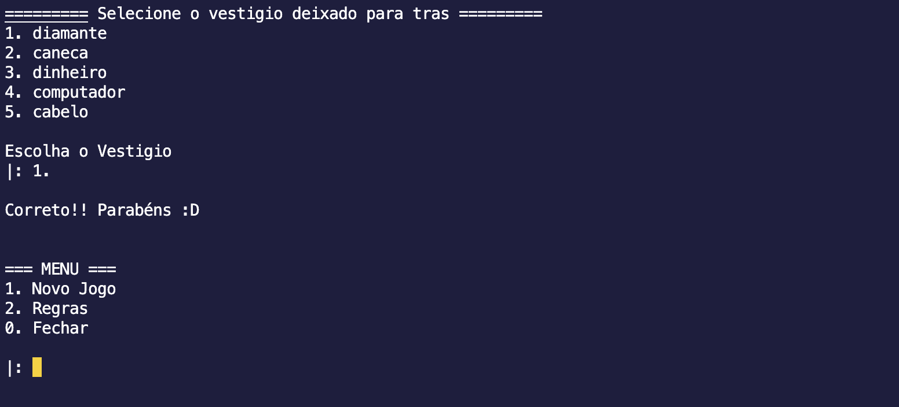
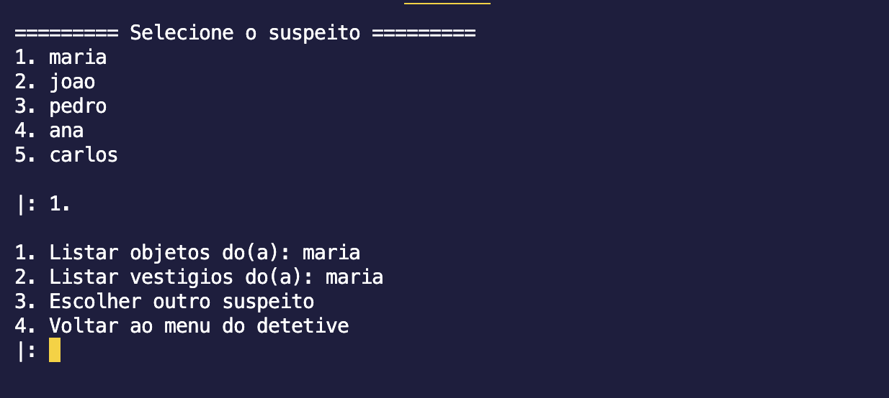

# 2023.1 G1 Lógico: Deception: Murder in Hong Kong

**Disciplina**: FGA0210 - PARADIGMAS DE PROGRAMAÇÃO - T02  
**Nro do Grupo (de acordo com a Planilha de Divisão dos Grupos)**: 01 
**Paradigma**: Funcional 

## Alunos
|Matrícula | Aluno |
| -- | -- |
| 19/0054832 | Arthur Talles de Sousa Cunha       |
| 18/0105256 | Lucas da Cunha Andrade             |
| 18/0066382 | Marcos Felipe de Almeida Souza     |
| 18/0129147 | Pedro de Miranda Haick             |
| 17/0114929 | Thiago França Vale Oliveira        |
| 18/0068229 | Victor Yukio Cavalcanti Miki       |

## Sobre 
Esse projeto trás um reinterpretação de um jogo de tabuleiro chamado Deception: Murder in Hong Kong para a linguagem Haskell usando os paradigmas da programação funcional.

Nesse jogo cooperativo, o cientista florence deve ajudar o(s) investigadore(s) a descobrir quem é o assassino. Apenas o cientista sabe quem é o assasino, qual foi a arma do crime e qual prova/vestigio foi deixado para trás. Assim, a cada turno os detetives pode pedir dicas limitadas até descobrirem que é o assassino e confirmarem sua resposta pelo menu de apontando um suspeito e suas respectivas armas.

O jogo acaba com os investigadores ganhando ou perdendo logo após confirmarem o palpite.

capa do jogo

esquema das dicas do jogo.

## Screenshots
Agora que conhecemos o jogo aki tem alguams screenshots do jogo funcionando.

Entre na pasta '/src' dentro do projeto e rode o comando:

> $ swipl main.pl

isso deve inicar o programa diretamente no arquivo main.

Agora é so jogar como veremos abaixo:

Para selecionar as opções digite o número seguido de um '.'.

> exemplo:

> -? 1.

#### MENU INICIAL

#### MENU DO CIENTISTA

#### MENU DOS INVESTIGADORES

#### MENU ESCOLHA DO TIPO DE DICA e DICA

#### DAR PALPITE

#### LISTAGENS DAS CARTAS

Para sair digite '0.' para sair do programa e:

> -? % halt

para sair do ambiente prolog.

## Instalação 
**Linguagens**: Prolog 
**Tecnologias**: swipl 
Pré-requisitos para rodar o seu projeto e os comandos necessários:

Instalar o [swipl](https://www.swi-prolog.org/download/stable). O SWI-Prolog é um popular ambiente de desenvolvimento para a linguagem de programação Prolog e oferece uma ampla gama de recursos e bibliotecas.

Após a instalação do SWI-Prolog, é necessário configurar o ambiente para que você possa rodar programas em Prolog. Isso geralmente envolve adicionar o diretório de instalação do SWI-Prolog ao seu PATH (variável de ambiente que lista os diretórios a serem pesquisados para encontrar executáveis).

* No Windows:

    * Abra o Painel de Controle e navegue até Sistema e Segurança -> Sistema -> Configurações avançadas do sistema.
    * Clique no botão "Variáveis de Ambiente" e encontre a variável PATH na seção Variáveis do Sistema.
    * Edite a variável PATH e adicione o diretório de instalação do SWI-Prolog (por exemplo, C:\Program Files\swipl\bin) ao final da lista, separado por um ponto-e-vírgula.

* No macOS e Linux:

    * pode usar o brew ou apt install swi-prolog.

Após instalação e configuração do ambiente de desenvolvimento clonamos o reposítório com o comando:

> $ git clone https://github.com/UnBParadigmas2023-1-Turma02/2023.1_G1_Logico-Deception_murder_investigation.git

## Uso 
Explique como usar seu projeto.
Procure ilustrar em passos, com apoio de telas do software, seja com base na interface gráfica, seja com base no terminal.
Nessa seção, deve-se revelar de forma clara sobre o funcionamento do software.

## Vídeo
Adicione 1 ou mais vídeos com a execução do projeto.
Procure: 
(i) Introduzir o projeto;
(ii) Mostrar passo a passo o código, explicando-o, e deixando claro o que é de terceiros, e o que é contribuição real da equipe;
(iii) Apresentar particularidades do Paradigma, da Linguagem, e das Tecnologias, e
(iV) Apresentar lições aprendidas, contribuições, pendências, e ideias para trabalhos futuros.
OBS: TODOS DEVEM PARTICIPAR, CONFERINDO PONTOS DE VISTA.
TEMPO: +/- 15min

## Participações
Participação dos membros do grupo para o projeto:
|Nome do Membro | Contribuição | Significância da Contribuição para o Projeto (Excelente/Boa/Regular/Ruim/Nula) |
| -- | -- | -- |
| Arthur Talles de Sousa Cunha       | checagem da condição de vitória, menu de palpites, pesquisa para limpar tela, popular o banco  | Excelente |
| Lucas da Cunha Andrade             | mecanismo de listagem, randomização das dicas, logica das dicas, menu do cientista e outras listagens | Excelente |
| Marcos Felipe de Almeida Souza     | listar cartas, popular banco, menu das cartas  | Boa |
| Pedro de Miranda Haick             |  popular banco | Boa |
| Thiago França Vale Oliveira        | Criar interface grafica e ajudar na correção de bugs | Boa |
| Victor Yukio Cavalcanti Miki       | I0dealização do projeto, mecanismo de consulta, popular banco, correções finais, documentacão  | Excelente |

## Outros 
Quaisquer outras informações sobre o projeto podem ser descritas aqui. Não esqueça, entretanto, de informar sobre:
(i) Lições Aprendidas;
(ii) Percepções;
(iii) Contribuições e Fragilidades, e
(iV) Trabalhos Futuros.

## Fontes
Referencie, adequadamente, as referências utilizadas.
Indique ainda sobre fontes de leitura complementares.
